<!-- GENERATED by tools/param-pages/widget_sheet.mjs — do not edit by hand.
     Regenerate with `node tools/param-pages/widget_sheet.mjs` after changing a
     widget; tests/host/test_widget_sheet.sh fails while this file is stale.
     Keep this page SHORT and user-facing — the rationale lives in
     docs/MODULES.md and in the code. -->

# Widgets

What each control on a knob page looks like, and what it means. Every picture
here is drawn by the code the device runs.

A cell shows the control it *is* — a dial for a sweep, a word for a choice, a
button for an action — and Schwung picks that from what the module declares.
Authors do not choose a widget; they declare a `type`, a range and options,
and the widget follows. (Developers: the selection rules are in
[MODULES.md](MODULES.md).)

---

## Values

### Knob

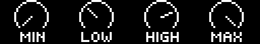

A continuous value. The pointer sweeps an arc from minimum to maximum. This is
most of the grid.

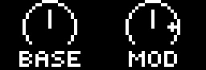

When an LFO or other source is driving the parameter, the pointer stays on the
value **you** set and a **dot** rides the arc at the value it is being pushed
to. The dot is there even when the two agree, so a knob under modulation never
looks like one that is not.

### Number

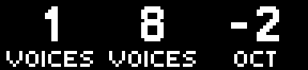

A small whole number — voices, an octave, a division — reads better as the
number itself than as a position on an arc. Ranges wider than about two dozen
go back to a knob, where the sweep is the useful part.

### Choice

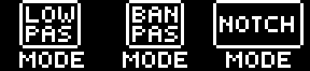

A value that is a word rather than an amount. Hold the knob and click to open
the full list; the knob alone steps through it one at a time. The square sizes
itself to the word.

### Switch

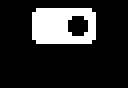

An on/off. Both states are drawn — the filled track is one, its inverse the
other — so you can see what the other position is without moving it.

### Action

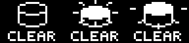

Some parameters *do* something rather than hold a value: Clear, Randomise,
Recover Loop. They draw as a push button and the label underneath names the
action. Click the jog to fire, or just turn the knob — a whole flick counts as
one press, so you cannot fire it repeatedly by accident.

### File, sample, and other editors

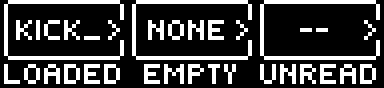

A cell whose contents live on another screen: a sample file, a drawing canvas,
a target picker. It shows what is loaded and a **›** meaning "there is more
in here". Click to open it. **NONE** means nothing is loaded yet.

---

## Pictures

Where several knobs describe one thing, Schwung draws the thing instead of the
knobs, across the cells they occupy.

| | |
|---|---|
| 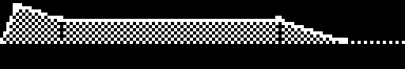 | **Envelope** — attack, decay, sustain and release as the shape they make. |
| 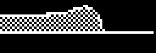 | **Filter** — the response curve, from cutoff and resonance. |
| 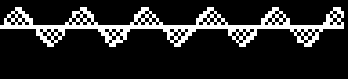 | **LFO** — the actual waveform, at its actual rate and depth. |
| 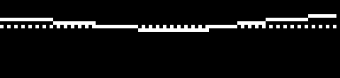 | **EQ** — band gains as a curve. |
| 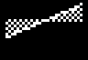 | **Waveform** — an oscillator shape drawn as the wave it names. |
| 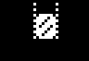 | **Fader** — a level as a column. |

### Sample

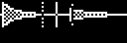

The file's real waveform, with the play position cut into it, loop points
bracketed, and a granular spray shown as the dotted fences it wanders between.
Clicking anywhere in the picture opens the full-screen wave editor.

With **no sample loaded there is no waveform** — the cells go back to being
ordinary controls, and the file cell reads NONE.

### Corner brackets

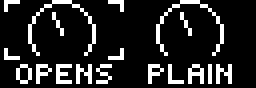

Brackets mean **this knob works, and it also opens something** — a sample
position you can scrub *and* edit full-screen. A cell with no brackets and no
**›** is just a control.

Plenty of other cells open things too — every list of options does. The footer
tells you: hold a knob and it reads `CLK OPEN` when there is something behind
it.

---

## The frame

| | |
|---|---|
| 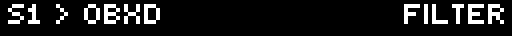 | **Header** — where you are, and which page. |
| 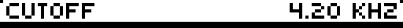 | Holding a knob replaces it with that parameter's full name and value. |
|  | **Pages** — one tick each, the current one filled. Turn the jog to move. |
| 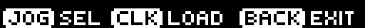 | **Hints** — what the jog, the click and Back do right here. |
| 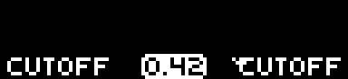 | **Labels** — the name at rest, the value while you hold the knob, and a `~` when something is modulating it. |
| 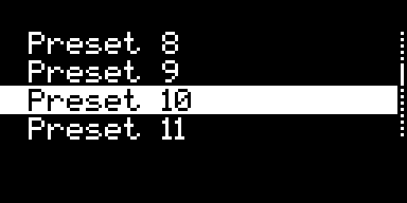 | **Lists** — the bar on the right shows how far through you are and how much is left. |

---

## Motion

Four widgets move when their value changes. The movement is the point: it tells
you something changed, and which way.

*Slowed 5x — on the device these take between a tenth and a third of a second.*

| | |
|---|---|
| 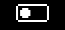 | **Switch** — the slug snaps to its new position and the fill sweeps after it. |
| 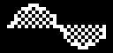 | **Waveform** — one shape bends into the next. |
|  | **Choice** — the square grows or shrinks to fit the new word. |
| 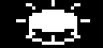 | **Action** — the button presses and throws a ring. Tap twice quickly and you get two rings, not one restarted. |
